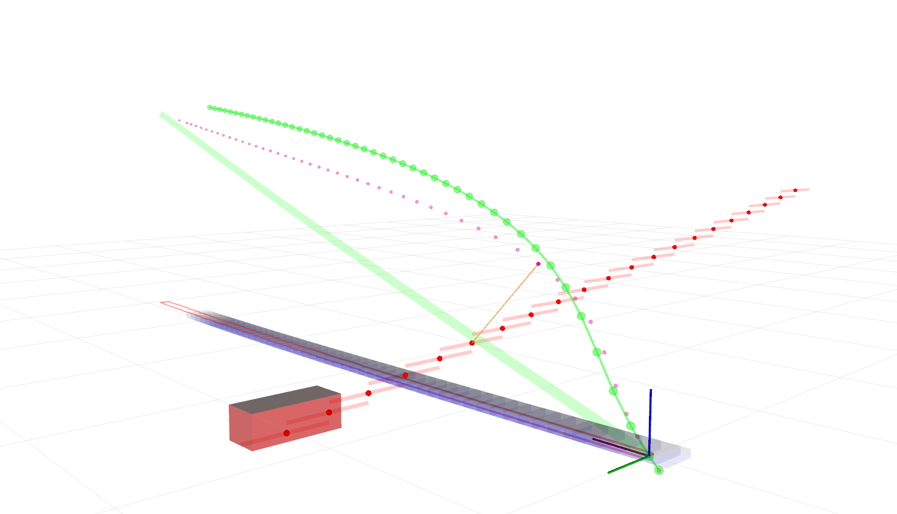

# STEB-Planner
STEB-Planner is a spatio-temporal elastic bands based trajectory planner for autonomous vehicles using semantic graph  optimization.

Keywords: autonomous driving, autonomous vehicle, motion planning, trajectory planning, path planning

> The paper of this method is published on the IEEE Robotics and Automation Letters (RA-L)

[Read the paper ](https://ieeexplore.ieee.org/document/10759749)

## 1. Performance Display
### 1.1 Static obstacle avoidance

<table border="0" width="100%">
  <tr>
    <td align="center" width="50%">
      
      <br>
      <em>Scenario 1: Static Obstacle Avoidance</em>
    </td>
    <td align="center" width="50%">
      
      <br>
      <em>Scenario 2: Static Obstacle Avoidance</em>
    </td>
  </tr>
</table>


### 1.2 Dynamic traffic Interaction
GIF playback speed is 1.6 times. More scenes will be uploaded later.
<table border="0" width="100%">
  <tr>
    <td colspan="2" align="center" width="100%">
      
      <br>
      <em>Scenario 3: Overtaking a slow car ahead</em>
    </td>
  </tr>

  <tr>
    <td  align="center" width="50%">
      
      <br>
      <em>Scenario 4: Unprotected Left Turn</em>
    </td>
    <td align="center" width="50%">
      
      <br>
      <em>Scenario 5: Merge Into the Traffic</em>
    </td>
  </tr>

  <tr>
    <td colspan="2" align="center" width="100%">
      
      <br>
      <em>Scenario 4: Unprotected Left Turn</em>
    </td>
  </tr>
</table>


## 2. Installation

### 2.1 Prerequisites

Our software is developed and tested in Ubuntu20.04 with ROS2 galactic. Follow [this link](https://docs.ros.org/en/galactic/Installation.html) to install galactic.


### 2.2 Required Library
- Eigen3
- PCL
- OpenCV
- G2O

Instal the g2o
```bash
sudo apt-get install ros-galactic-libg2o
```


### 2.3 Download & Compile
```bash
# Download
cd ~/your_workspace/src
git clone https://github.com/heshanchuan/STEB-Planner.git

# Compile
cd ../
source /opt/ros/galactic/setup.bash
colcon build  --symlink-install  --cmake-args -DCMAKE_EXPORT_COMPILE_COMMANDS=ON -DCMAKE_BUILD_TYPE=Release

```


## 3. Usage example

### 3.1 Run the STEB planner
```bash
source install/setup.bash
ros2 launch steb_planner steb_planner_test.launch.xml
```

### 3.2 Play the rosbag
```bash
source install/setup.bash
cd src/STEB-Planner/rosbags
ros2 bag play rosbag2_2025_02_25-16_47_27/ --clock
#or
ros2 bag play rosbag2_2024_05_03-16_34_11/ --clock 
```

### 3.3 then you will see the following pics
<table border="0" width="100%">
  <tr>
    <td align="center" width="50%">
      
      <br>
      <em>rosbag 1</em>
    </td>
    <td align="center" width="50%">
      
      <br>
      <em>rosbag 2</em>
    </td>
  </tr>
</table>


## 4. Release History
Notes: 1.0.0 will be our first elegant version.
* 0.1
    * CHANGE: First upload readme and some multimedia files
* 1.0
    * CHANGE: Upload the whole project

## 5. Contributing

1. Fork it (<https://github.com/heshanchuan/STEB-Planner/fork>)
2. Create your feature branch (`git checkout -b feature/fooBar`)
3. Commit your changes (`git commit -am 'Add some fooBar'`)
4. Push to the branch (`git push origin feature/fooBar`)
5. Create a new Pull Request

## 6. License

The source code is released under [MIT](https://opensource.org/licenses/MIT) license.

## 7. Disclaimer

This is research code, it is distributed in the hope that it will be useful, but WITHOUT ANY WARRANTY; without even the implied warranty of merchantability or fitness for a particular purpose.

## 8. Acknowledgments
In this project, certain files or functions from the following open-source codes have been utilized, and we would like to express our gratitude here:
- [Autoware](https://github.com/autowarefoundation/autoware.universe)
- [EPSILON](https://github.com/HKUST-Aerial-Robotics/EPSILON)
- [teb_local_planner](https://github.com/rst-tu-dortmund/teb_local_planner)

##  Citation
```
@ARTICLE{10759749,
  author={He, Shan and Ma, Yalong and Song, Tao and Jiang, Yongzhi and Wu, Xinkai},
  journal={IEEE Robotics and Automation Letters}, 
  title={A Real-Time Spatio-Temporal Trajectory Planner for Autonomous Vehicles With Semantic Graph Optimization}, 
  year={2025},
  volume={10},
  number={1},
  pages={72-79},
  keywords={Trajectory;Semantics;Vehicle dynamics;Optimization;Planning;Trajectory planning;Real-time systems;Autonomous vehicles;Safety;Roads;Autonomous vehicle navigation;intelligent transportation systems;motion and path planning},
  doi={10.1109/LRA.2024.3504239}}
```
